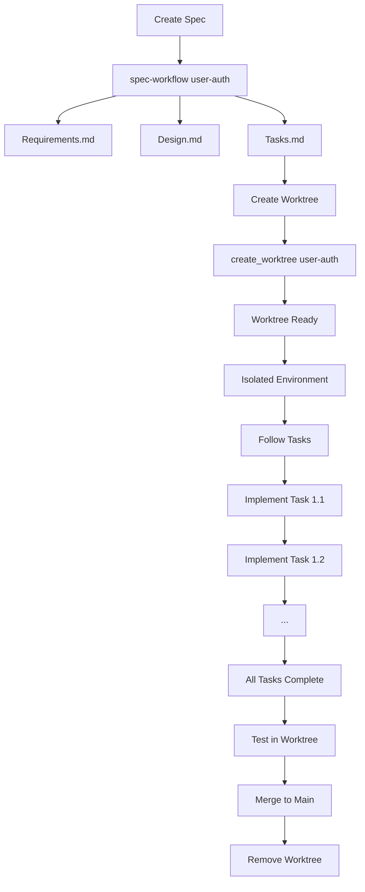

# Worktree Integration with Spec-Driven Development

How to use git worktrees for isolated feature implementation after creating specifications.

## Overview

**Worktrees** create isolated development environments with separate:
- Git branches
- Port configurations
- Database instances
- Dependencies

**Use After**: Creating complete specs (Requirements → Design → Tasks)

**Purpose**: Implement features in isolation without affecting main codebase

---

## When to Use Worktrees

### Use Worktrees When:
- ✅ Implementing complex feature with many tasks
- ✅ Multiple developers working on different features in parallel
- ✅ Want to test implementation without affecting main development
- ✅ Need isolated database for feature data
- ✅ Experimenting with implementation approaches
- ✅ Feature requires different dependency versions

### Skip Worktrees When:
- ❌ Simple feature with few tasks (< 5 tasks)
- ❌ Solo development with no parallel work
- ❌ Feature is low-risk and straightforward
- ❌ Quick bug fix or minor change
- ❌ Don't need port/database isolation

**Default Recommendation**: Use worktrees for anything with 10+ implementation tasks

---

## Creating Worktrees

### After Spec Creation

**Step 1: Complete Specification**
```
@spec-orchestrator create spec for user-authentication
```

Results in:
- `specs/requirements-user-authentication.md`
- `specs/design-user-authentication.md`
- `specs/tasks-user-authentication.md` (12 tasks)

**Step 2: Create Worktree**
```bash
/create_worktree user-authentication
```

Or use the skill:
```
Create a worktree for user-authentication feature
```

**Step 3: Worktree Setup Completes**

Automatic setup:
- Creates `trees/user-authentication/` directory
- Checks out branch `user-authentication`
- Configures unique ports (server: 4010, client: 5183)
- Sets up isolated database (`events.db` in worktree)
- Installs dependencies
- **Starts services automatically** (background)

```
✅ Worktree Created and Started

Location: trees/user-authentication
Ports: Server 4010, Client 5183
Status: 🟢 RUNNING

Access URLs:
- Dashboard: http://localhost:5183
- API: http://localhost:4010

Specs Available:
- requirements-user-authentication.md
- design-user-authentication.md
- tasks-user-authentication.md

Ready for implementation!
```

---

## Worktree Structure

```
peritus-repo-template/          # Main repository
├── trees/                      # Worktrees directory
│   ├── user-authentication/    # Feature worktree
│   │   ├── specs/              # Specs copied to worktree
│   │   │   ├── requirements-user-authentication.md
│   │   │   ├── design-user-authentication.md
│   │   │   └── tasks-user-authentication.md
│   │   ├── apps/
│   │   │   ├── server/
│   │   │   │   ├── .env        # Port: 4010, isolated DB
│   │   │   │   └── events.db   # Worktree-specific database
│   │   │   └── client/
│   │   │       └── .env        # Port: 5183, API: 4010
│   │   └── .env                # Root env with API keys
│   │
│   └── file-upload/            # Another feature worktree
│       ├── specs/
│       ├── apps/               # Ports: 4020/5193
│       └── ...
│
└── specs/                      # Original specs (main branch)
```

---

## Port Assignment

**Main Repository**:
- Server: `4000`
- Client: `5173`

**Worktrees** (auto-assigned):
- First worktree: Server `4010`, Client `5183` (offset 1)
- Second worktree: Server `4020`, Client `5193` (offset 2)
- Third worktree: Server `4030`, Client `5203` (offset 3)

**Pattern**: Each worktree gets unique ports via offset × 10

---

## Implementation Workflow

### Step 1: Open Worktree in Claude Code

```bash
cd trees/user-authentication
code .  # Or open in Claude Code
```

### Step 2: Review Specs

Specs are available in worktree:
```bash
cat specs/requirements-user-authentication.md
cat specs/design-user-authentication.md
cat specs/tasks-user-authentication.md
```

### Step 3: Follow Task Sequence

From `tasks-user-authentication.md`:
```markdown
- [ ] 1. Setup authentication foundation
- [ ] 1.1 Create project structure and core interfaces
  - Set up directory structure
  - Define TypeScript interfaces
  - Create base configuration
  - Requirements: REQ-1.1
```

### Step 4: Implement Tasks Sequentially

```
Implement task 1.1 from specs/tasks-user-authentication.md
```

Claude implements following spec exactly:
- Creates files specified
- Implements functionality described
- Writes tests as indicated
- References requirements

### Step 5: Test in Isolation

Services running on isolated ports:
- Visit http://localhost:5183 for UI
- API at http://localhost:4010
- Isolated database - no conflict with main

### Step 6: Mark Tasks Complete

Update `tasks-user-authentication.md`:
```markdown
- [x] 1.1 Create project structure and core interfaces ✅
- [ ] 1.2 Set up testing framework...
```

### Step 7: Merge When Complete

```bash
# From main repo
git checkout main
git merge user-authentication
git push

# Remove worktree
git worktree remove trees/user-authentication
```

---

## Parallel Development

### Multiple Features Simultaneously

**Developer A - User Auth** (Worktree 1):
```bash
/create_worktree user-authentication
cd trees/user-authentication
# Work on auth (ports 4010/5183)
```

**Developer B - File Upload** (Worktree 2):
```bash
/create_worktree file-upload
cd trees/file-upload
# Work on upload (ports 4020/5193)
```

**Developer C - Main Branch**:
```bash
# Continue work on main (ports 4000/5173)
```

**Result**: Three isolated environments, no conflicts

---

## Advantages of Worktrees for Specs

### 1. Isolated Implementation

Specs guide implementation in isolation:
- Follow task sequence exactly
- Test without affecting main
- Experiment safely
- Database is isolated

### 2. Spec-Driven Development

Worktree contains complete specs:
```
specs/
├── requirements-*.md  # What to build
├── design-*.md        # How to build it
└── tasks-*.md         # Step-by-step guide
```

Follow tasks sequentially with confidence.

### 3. Parallel Specs, Parallel Implementation

Create multiple specs:
```bash
/spec-workflow auth
/spec-workflow search
/spec-workflow notifications
```

Implement in parallel worktrees:
```bash
/create_worktree auth
/create_worktree search
/create_worktree notifications
```

### 4. Easy Comparison

Compare implementations:
- Main: http://localhost:5173
- Auth: http://localhost:5183
- Search: http://localhost:5193

Side-by-side testing.

### 5. Safe Experimentation

Worktree lets you:
- Try different implementation approaches
- Test risky changes
- Refactor freely
- Discard if needed

Main codebase remains stable.

---

## Best Practices

### Creating Worktrees

**Do**:
- ✅ Create after complete specs
- ✅ Use feature name from specs
- ✅ Copy specs to worktree for reference
- ✅ Let auto-configuration handle ports

**Don't**:
- ❌ Create before specs complete
- ❌ Manually configure ports (auto-handled)
- ❌ Modify main while working in worktree
- ❌ Forget to commit in worktree

### Implementing in Worktrees

**Do**:
- ✅ Follow task sequence from tasks.md
- ✅ Reference requirements and design
- ✅ Test continuously in isolated environment
- ✅ Commit progress regularly

**Don't**:
- ❌ Skip tasks or change order without reason
- ❌ Ignore the specs
- ❌ Mix multiple features in one worktree
- ❌ Leave worktrees unmerged indefinitely

### Merging and Cleanup

**Do**:
- ✅ Complete all tasks before merging
- ✅ Test thoroughly in worktree
- ✅ Review all changes
- ✅ Remove worktree after merge

**Don't**:
- ❌ Merge incomplete features
- ❌ Leave orphaned worktrees
- ❌ Force merge with conflicts
- ❌ Delete worktree with uncommitted changes

---

## Worktree Commands Reference

### Create Worktree
```bash
/create_worktree [feature-name]
```

### List Worktrees
```bash
/list_worktrees
```

### Remove Worktree
```bash
/remove_worktree [feature-name]
```

Or manually:
```bash
git worktree remove trees/[feature-name]
```

### Check Worktree Status
```bash
git worktree list
```

---

## Troubleshooting

### Port Already in Use

**Problem**: Worktree creation fails due to port conflict

**Solution**:
```bash
# Kill processes on port
lsof -ti :4010 | xargs kill -9

# Or use different offset
/create_worktree feature-name 2  # Uses ports 4020/5193
```

### Worktree Won't Start

**Problem**: Services don't start after creation

**Solution**:
```bash
cd trees/[feature-name]

# Manual start
SERVER_PORT=4010 CLIENT_PORT=5183 sh scripts/start-system.sh
```

### Lost Specs in Worktree

**Problem**: Can't find specs in worktree

**Solution**:
```bash
# Copy from main
cp specs/requirements-[feature].md trees/[feature]/specs/
cp specs/design-[feature].md trees/[feature]/specs/
cp specs/tasks-[feature].md trees/[feature]/specs/
```

### Merge Conflicts

**Problem**: Conflicts when merging worktree to main

**Solution**:
```bash
# From worktree
git fetch origin main
git rebase origin/main
# Resolve conflicts
git add .
git rebase --continue

# Then merge from main
git checkout main
git merge [feature-branch]
```

---

## Integration with Spec Workflow

### Complete Flow Example



---

## Summary

**Worktrees** provide isolated implementation environments:
- ✅ Separate ports and databases
- ✅ Contains complete specs
- ✅ Enables parallel development
- ✅ Safe experimentation

**Use after creating specs for**:
- Complex features (10+ tasks)
- Parallel development
- Need for isolation
- Experimental implementations

**Workflow**:
1. Create complete spec
2. Create worktree: `/create_worktree [feature]`
3. Implement following tasks.md
4. Test in isolation
5. Merge to main
6. Remove worktree

**Optional but Recommended** for systematic, isolated feature development.

---

**Related Documentation**:
- [Workflow Patterns](workflow-patterns.md)
- [Main Guide](../SPEC_DRIVEN_DEVELOPMENT.md)
- [Worktree Manager Skill](../.claude/skills/worktree-manager-skill/SKILL.md)


